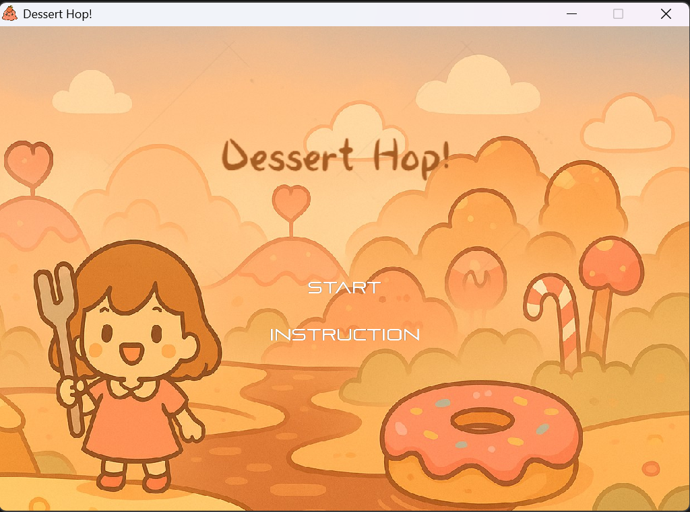
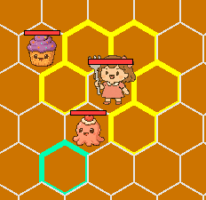
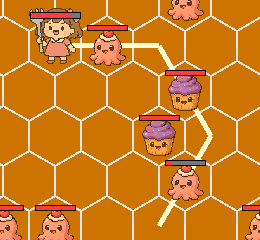
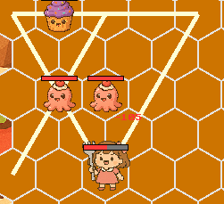
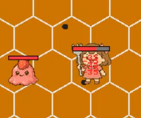
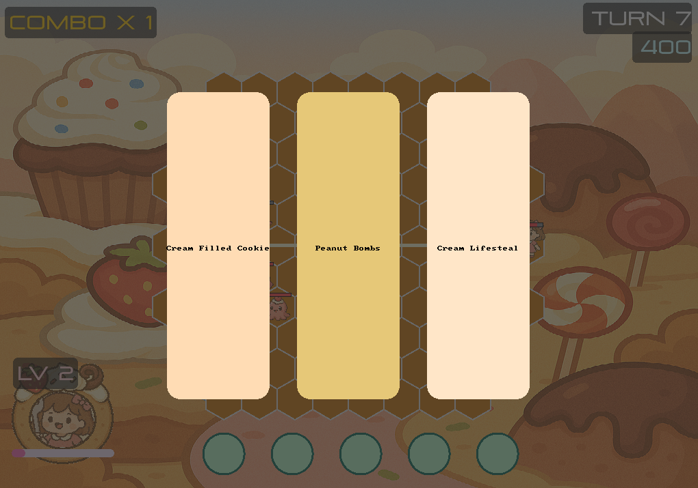

# 甜點跳跳樂 Dessert Hop!

<p align="center">
  
</p>

<p align="center">
  一款結合 <b>回合制策略</b> 與 <b>路徑規劃</b> 的六角棋盤遊戲  
  A turn-based strategy game combined with path planning on a hex grid
</p>

---

## 遊戲介紹 Introduction

**甜點跳跳樂 Dessert Hop!** 是一款結合回合制戰鬥與路徑規劃的策略遊戲。  
玩家需要在六角棋盤上規劃跳躍路徑，透過移動、攻擊與技能搭配來擊敗敵人並生存到最後。

Dessert Hop! is a turn-based strategy game with path planning mechanics.  
Players plan their movement on a hex grid, attack enemies through movement,  
and use skills strategically to survive as long as possible.

---

## 遊戲特色 Features

- 回合制戰鬥系統（Turn-based combat system）
- 六角棋盤上的路徑規劃移動（Path planning on a hex grid）
- 跳躍經過敵人時自動攻擊（Automatic attack when passing enemies）
- Combo 連擊系統（Combo system）
- 擊殺敵人後升級並隨機三選一技能（Level-up with random skill selection）
- 共 15 種技能，可持續升級強化（15 upgradeable skills）

---

## How to Play 遊玩方式

- **Plan Your Path（規劃路徑）**  
  Click highlighted tiles to build your jump sequence.  
  用滑鼠點擊亮起的格子規劃跳躍路徑（黃色為鄰近移動，綠色為跳躍攻擊）。  
  若走錯可按 `Backspace` 回到上一步。

<p align="center">
  <table>
    <tr>
      <td></td>
      <td></td>
    </tr>
  </table>
</p>

- **Execute Movement（執行移動）**  
  Press `Space`  to auto-hop along your path.  
  按下 `Space`  後角色會依照規劃路徑自動移動，跳過敵人會造成傷害，並可能觸發技能效果。
  <p align="center">
  <table>
    <tr>
      <td></td>
    </tr>
  </table>
</p>

- **Enemy Phase（敵人回合）**  
  After your move, enemies will move toward you and attack.  
  玩家行動結束後，敵人會自動朝玩家移動並進行攻擊。
    <p align="center">
  <table>
    <tr>
      <td></td>
    </tr>
  </table>
</p>

- **Skills & Upgrades（技能與升級）**  
  Defeat enemies to gain EXP and level up. Each level lets you choose from random skills to enhance your combat style.  
  擊敗敵人可獲得經驗並升級。每次升級時可從隨機技能中選擇一項強化能力，不同技能可提升傷害、範圍效果或生存能力。  
  <p align="center">
  <table>
    <tr>
      <td></td>
    </tr>
  </table>
</p>

- **Victory & Defeat（勝敗條件）**  
  Survive to turn 50 to win.  
  存活至第 50 回合即可勝利；HP 歸零則遊戲結束。

---

## 遊戲畫面 Screenshots

<p align="center">
  
</p>

---

## 下載與執行方式 Download & Run

請至 GitHub 的 **Releases** 頁面下載遊戲壓縮檔。  
Download the game from the **Releases** section on GitHub.

### 執行步驟 Steps
1. 下載 zip 檔（Download the zip file）
2. 解壓縮所有檔案（Extract all files）
3. 執行 `game.exe`（Run `game.exe`）

---

## 注意事項 Notes

- `game.exe`、`assets` 資料夾與必要的 `.dll` 檔案必須放在同一個資料夾  
  Keep `game.exe`, `assets`, and required `.dll` files in the same directory

- 若 Windows 顯示安全性警告，請點選 **更多資訊 → 仍要執行**  
  If Windows shows a warning, click **More info → Run anyway**

---

## 使用技術 Tech Stack

- C
- Allegro 5
- Makefile

---

## 專案結構 Project Structure

```text
SourceCode/
├── assets/
├── board/
├── element/
├── monster/
├── player/
├── scene/
├── shapes/
├── skill/
├── system/
├── ui/
├── main.c
├── GameWindow.c
├── global.c
└── makefile
